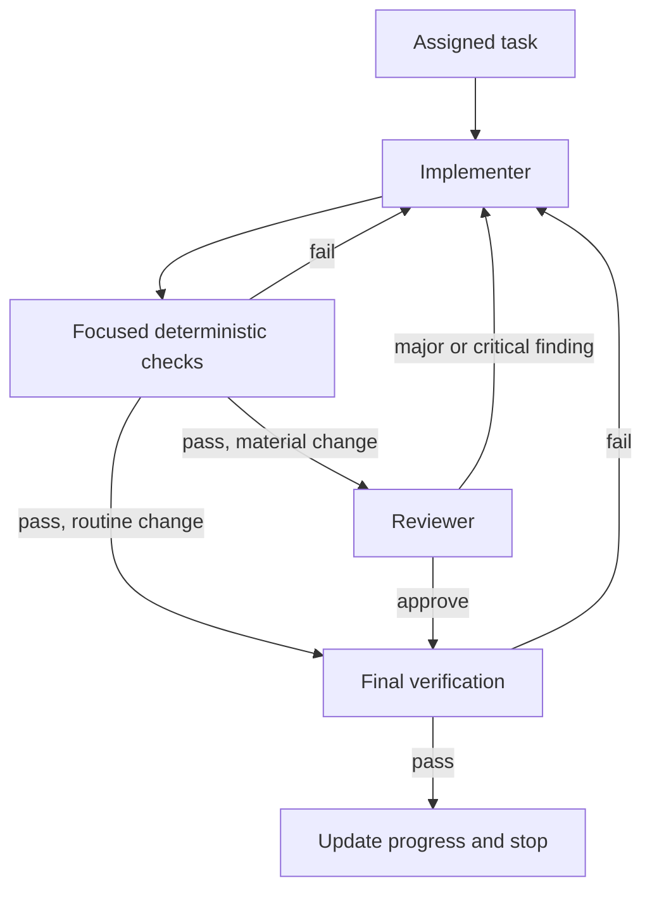

# Agent System

## Purpose

Development work is a small evidence-driven graph, not a chain of copied
conversation history. Use deterministic programs and checks where they can
replace a model or agent.



## Roles

| Role | Use when | Inputs | Outputs | Completion evidence |
| --- | --- | --- | --- | --- |
| Implementer | Default bounded code or documentation task | Task, relevant authority, source/tests, relevant skill | Scoped change, tests, evidence | Acceptance criteria and required checks pass |
| Reviewer | Material behavior, contracts, security, persistence, compiler, or AI-routing change | Task, authority, diff, verification results | Critical/Major/Minor/Optional findings | No unresolved Critical or Major finding |
| Architect | Cross-component architecture, public contract, persistence, or trust-boundary change | Product spec, existing architecture, decision context | ADR, architecture constraint, task inputs | Decision is explicit, reversible where practical, and recorded |
| Verifier | Final evidence needs independent execution or acceptance review | Task, required commands, artifacts | Pass/fail evidence and residual risk | Required gate result is recorded |

Do not create specialist roles until repeatable work justifies one. A role owns a
responsibility; a project skill describes a specialized procedure.

## Node Contract

Every worker receives only its role, objective, authorities, scope,
acceptance criteria, verification commands, expected output, and transition.
Workers return evidence and artifact paths, not hidden reasoning.

```yaml
task_id: TASK-001
owner_role: implementer
objective: Concise observable outcome
inputs:
  - AGENTS.md
  - relevant authority and source
constraints:
  - scope and safety boundaries
acceptance_criteria:
  - observable requirement
verification:
  - exact established command or manual procedure
outputs:
  - changed files, tests, and evidence
success_next: reviewer
failure_next: implementer
```

## Bounded Loop

1. Load task-relevant context and inspect current code/tests.
2. Implement the smallest coherent change.
3. Run focused checks and diagnose confirmed failures.
4. Fix and run required verification.
5. Inspect the diff against acceptance criteria.
6. Persist progress, assumptions, and blockers; route to the next role or stop.

Maximum attempts for the same blocker: three materially distinct attempts. Stop
earlier for security, data-loss, public-contract, migration, deployment, or
human-approval boundaries. Preserve the best verified state in
`docs/progress.md` and request direction rather than retrying without evidence.

## Review Gate

Independent review is required for core workflow behavior, public interfaces,
algorithm registry policy, compiler/execution logic, provider/tool policy,
security, persistence, and broad cross-cutting changes. Routine documentation
or isolated tests may proceed directly to final verification.
