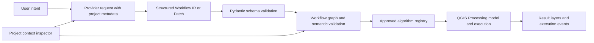

# Architecture

## Purpose and Shape

GeoCompiler is a conventional QGIS Python plugin. Its primary output is an
editable QGIS Processing workflow, not a one-off answer or autonomous desktop
action. The MVP is vector-first and supports a deliberately small operation
registry.

## Component Boundaries

| Boundary | Responsibility | Must not own |
| --- | --- | --- |
| UI | Native PyQt/PyQGIS dock widget, proposal review, workflow inspection, execution state | Spatial semantics or direct execution policy |
| Project context | Deterministic inspection of layers, fields, geometry, CRS, and history | Raw-data transmission by default |
| AI boundary | Provider-independent request construction and structured response parsing | Compiler decisions or execution |
| Workflow core | Pure-Python Workflow IR, patches, diffs, graph validation, metadata persistence | QGIS runtime or provider SDK behavior |
| Compiler and execution | Registry resolution, model generation, Processing execution, mapped errors | Model inference or arbitrary code execution |
| Observability | Structured development events and local metrics | Sensitive geographic feature payloads |

The dock widget is the initial product surface. QGIS Processing model tooling is
the full workflow editor; GeoCompiler should not recreate a graph editor for
the MVP. Qt Designer may later define stable PyQt layouts. QML, embedded web
interfaces, and a standalone application are out of scope.

## Data and Trust Flow

The only model-to-execution path is through schema validation, workflow
validation, and the approved registry. An unsupported operation, missing field,
invalid geometry, incompatible CRS, or disconnected graph is a visible failure,
not an inferred substitute.

## Important Invariants

- Workflow inputs and parameters remain portable; avoid hard-coded project paths
  and layer names where an input or parameter represents the intent.
- Metric distance and area operations require deterministic CRS suitability
  checks; do not treat degrees as metres.
- QGIS performs spatial calculation. Models interpret intent, plan workflows,
  generalize history, and propose patches only.
- Provider integrations depend on the workflow-core contracts, never the
  reverse. Compiler integrations depend on the registry, never raw model text.
- All external-provider payloads are minimized to needed metadata by default.

## Failures and Observability

Map failures to workflow nodes and QGIS algorithms where possible. Record
event names such as `workflow.generated`, `workflow.compiled`,
`workflow.execution.failed`, `algorithm.unsupported`, and `llm.schema_failure`.
Do not log raw feature values, geometry coordinates, credentials, or connection
strings by default.

## Local Development and Scale

The initial runtime is a locally installed QGIS instance. Pure workflow-core
tests run without QGIS or remote model calls; PyQGIS integration tests require a
reproducible QGIS runtime. The initial bottleneck is correctness and clear
failure behavior, not distributed throughput.
